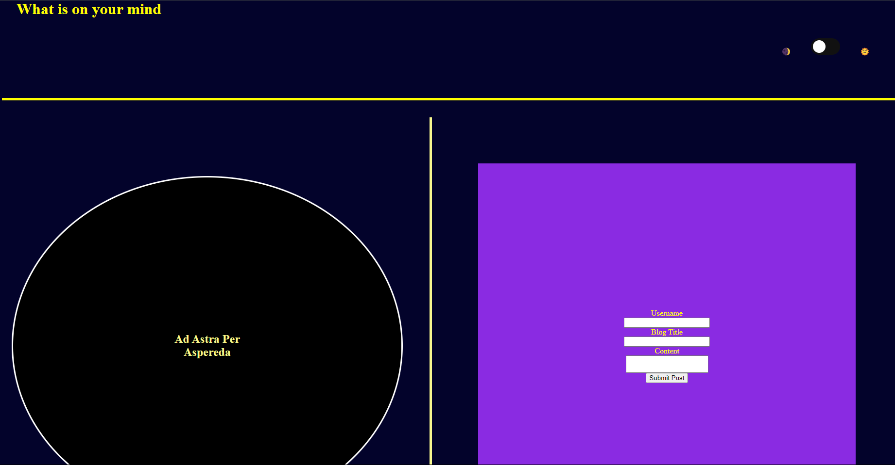
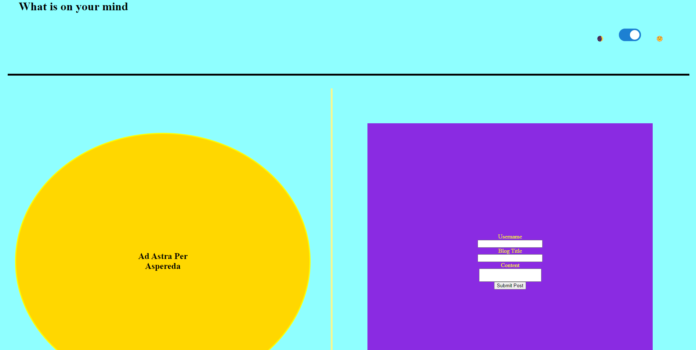
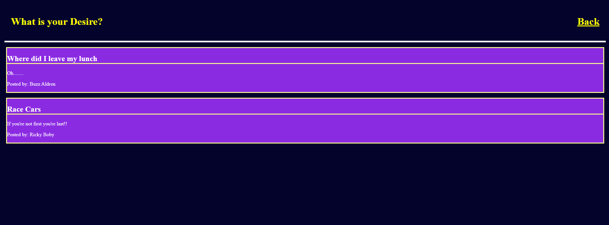

# Personal-blog

## Description
A prototype personal blog that includes a theme switcher for the landing and a form to submit form posts that on submission take you to a different page where the Post is placed programmaticly.

## Installation
N/A

## Usage
   a prototype for which one could build a personal forum or blog
## Screen Shot

## Credits

README. Template Provided by codeing boot camp Full- Stack Blog. url: https://coding-boot-camp.github.io/full-stack/github/professional-readme-guide

Theme Switch Style by SMU/EDX Insturctional staff refer to form.css for more details.
collaberated with Instructional staff for debugging.

## License

N/A
